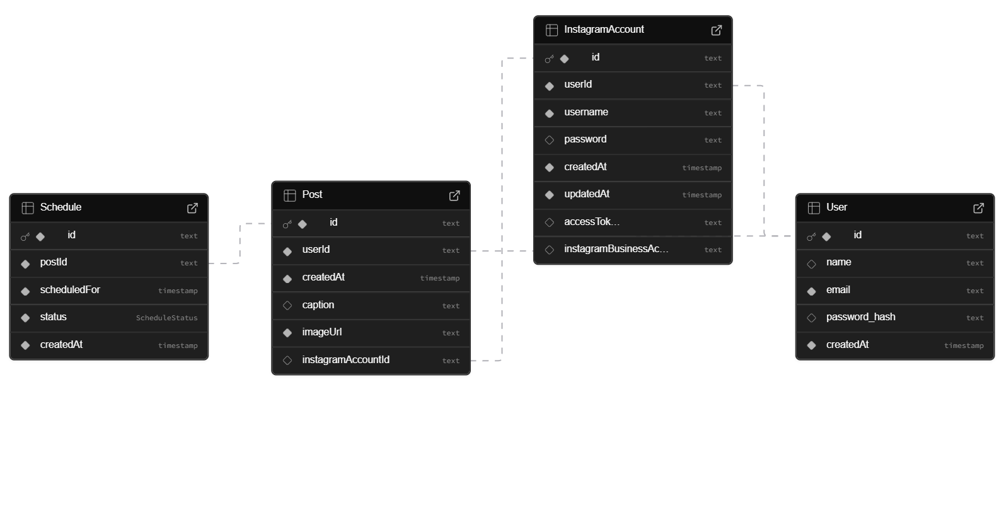

# Insta Auto - Instagram Automation Platform Documentation

## Overview

Insta Auto is a Next.js-based web application designed for automating Instagram workflows. It curretnly provides a interface for managing Instagram accounts, scheduling posts, and handling authentication. The platform allows users to link their Instagram accounts, create and schedule posts with captions and images, and view their post history.


## Tech Stack

- **Framework**: Next.js 16 (App Router) - For building the React-based web application with server-side rendering.
- **Authentication**: NextAuth.js v5 - Handles user authentication and session management.
- **Database**: Supabase (PostgreSQL) - Cloud-hosted database for data persistence.
- **ORM**: Prisma 7.4.0 - For database schema definition, migrations, and type-safe queries.
- **Language**: TypeScript - Provides type safety and improved developer experience.
- **Password Hashing**: bcryptjs - For secure password storage.
- **Validation**: Zod - For runtime type validation and schema enforcement.
- **Meta Graph API**: Third-Party API / External Service Integration

## Project Structure

The project follows a standard Next.js App Router structure with additional directories for organization:

```
insta-auto/sns-instagram/
├── app/                          # Next.js App Router directory
│   ├── actions/                  # Server actions (e.g., auth.ts)
│   ├── api/                      # API routes
│   │   ├── accounts/             # Instagram account management
│   │   ├── auth/                 # NextAuth configuration
│   │   └── posts/                # Post management
│   ├── dashboard/                # Protected dashboard page
│   ├── signin/                   # Sign-in page
│   ├── signup/                   # Sign-up page
│   ├── globals.css               # Global styles
│   ├── layout.tsx                # Root layout
│   ├── page.tsx                  # Home page
│   └── providers.tsx             # Context providers
├── lib/                          # Shared utilities and components
│   ├── components/               # Reusable React components
│   │   ├── PostUpload.tsx        # Post creation/upload component
│   │   └── Toast.tsx             # Notification component
│   ├── hooks/                    # Custom React hooks
│   │   └── use-toast.tsx         # Toast notification hook
│   ├── prisma-client/            # Generated Prisma client
│   ├── prisma.ts                 # Prisma client instance
│   ├── supabase.ts               # Supabase client configuration
│   └── validation.ts             # Zod schemas for validation
├── prisma/                       # Database schema and migrations
│   └── schema.prisma             # Prisma schema definition
├── scripts/                      # Utility scripts
│   ├── create-test-post.ts       # Script to create test posts
│   └── link-account.ts           # Script to link Instagram accounts
├── types/                        # TypeScript type definitions
│   └── next-auth.d.ts            # NextAuth type extensions
├── auth.config.ts                # NextAuth configuration
├── auth.ts                       # NextAuth setup with providers
├── middleware.ts                 # Next.js middleware
├── next.config.ts                # Next.js configuration
├── package.json                  # Dependencies and scripts
├── README.md                     # Project README
├── test-db.ts                    # Database testing script
└── tsconfig.json                 # TypeScript configuration
```

## Database Schema

The application uses Prisma to define and manage the database schema. The schema is defined in `prisma/schema.prisma` and includes the following models:

### User Model
- **id**: Unique identifier (CUID)
- **name**: Optional display name
- **email**: Unique email address (required)
- **password_hash**: Hashed password for authentication
- **createdAt**: Timestamp of account creation
- **posts**: One-to-many relationship with Post
- **instagramAccounts**: One-to-many relationship with InstagramAccount

### InstagramAccount Model
- **id**: Unique identifier (CUID)
- **userId**: Foreign key to User
- **username**: Instagram username (required)
- **password**: Optional password (for automation)
- **accessToken**: Optional access token for API access
- **instagramBusinessId**: Optional Instagram Business ID
- **createdAt**: Timestamp of account creation
- **updatedAt**: Timestamp of last update
- **user**: Many-to-one relationship with User
- **posts**: One-to-many relationship with Post

*Note*: Unique constraint on (userId, username) prevents duplicate accounts for the same user.

### Post Model
- **id**: Unique identifier (CUID)
- **userId**: Foreign key to User
- **instagramAccountId**: Foreign key to InstagramAccount
- **caption**: Optional post caption
- **imageUrl**: URL of the post image (required)
- **createdAt**: Timestamp of post creation
- **user**: Many-to-one relationship with User
- **instagramAccount**: Many-to-one relationship with InstagramAccount
- **schedules**: One-to-many relationship with Schedule

### Schedule Model
- **id**: Unique identifier (CUID)
- **postId**: Foreign key to Post
- **scheduledFor**: DateTime for when the post should be published
- **status**: Enum status (PENDING, PROCESSING, PUBLISHED, FAILED)
- **createdAt**: Timestamp of schedule creation
- **post**: Many-to-one relationship with Post

### ScheduleStatus Enum
- **PENDING**: Post is scheduled but not yet processed
- **PROCESSING**: Post is being processed for publication
- **PUBLISHED**: Post has been successfully published
- **FAILED**: Post publication failed

## Authentication System

The application uses NextAuth.js v5 for authentication with the following configuration:

### NextAuth Configuration (`auth.config.ts`)
- **Pages**: Custom sign-in page at `/signin`
- **Session Strategy**: JWT-based sessions
- **Callbacks**:
  - `jwt`: Adds user ID to JWT token
  - `session`: Includes user ID in session object

### Authentication Setup (`auth.ts`)
- **Adapter**: PrismaAdapter for database integration
- **Provider**: CredentialsProvider for email/password authentication
- **Validation**: Email format validation and disposable email blocking
- **Password Verification**: Uses bcryptjs for secure password comparison

### Middleware (`middleware.ts`)
- Protects routes requiring authentication (e.g., `/dashboard`)
- Redirects unauthenticated users to `/signin`

### Server Actions (`app/actions/auth.ts`)
- `createUser`: Handles user registration with validation and password hashing

## API Routes

### Authentication API (`/api/auth/[...nextauth]`)
- Handles NextAuth.js authentication routes
- Supports sign-in, sign-out, and session management

### Posts API (`/api/posts`)
- **GET**: Retrieves posts for the authenticated user, including schedules
- Returns posts ordered by creation date (newest first)
- Requires authentication

- **POST**: Creates a new post
- Validates request body using Zod schema
- Prevents duplicate posts within 1 minute
- Supports optional scheduling
- Requires authentication


## Utility Scripts

### create-test-post.ts
- Creates a test post in the database
- Useful for development and testing purposes

### link-account.ts
- Links an Instagram account to a user
- Handles account creation and association

## Validation and Security

### Validation (`lib/validation.ts`)
- **Email Validation**: Checks format and blocks disposable email domains
- **Password Validation**: Enforces minimum length, character requirements, and strength
- **Post Schema**: Validates post creation requests
- Uses Zod for runtime validation

### Security Features
- Password hashing with bcryptjs
- JWT-based session management
- API route protection with authentication checks
- Duplicate post prevention
- Input sanitization and validation

## Setup and Deployment

### Prerequisites
- Node.js v18+
- npm, yarn, or pnpm
- Supabase account
- Git

### Local Development Setup
1. Clone the repository
2. Install dependencies: `npm install`
3. Set up Supabase project and database
4. Create `.env` file with required environment variables
5. Run database migrations: `npx prisma migrate dev`
6. Generate Prisma client: `npx prisma generate`
7. Start development server: `npm run dev`

### Environment Variables
- `NEXT_PUBLIC_SUPABASE_URL`: Supabase project URL
- `NEXT_PUBLIC_SUPABASE_ANON_KEY`: Supabase anonymous key
- `SUPABASE_SERVICE_ROLE_KEY`: Supabase service role key
- `AUTH_SECRET`: NextAuth secret (generate with `openssl rand -base64 32`)
- `DATABASE_URL`: Supabase database connection string

### Database Setup
Run the provided SQL in Supabase to create the users table, then use Prisma migrations for the full schema.

## Features Implemented

### User Management
- User registration with email and password
- Secure password hashing and validation
- Email format validation and disposable email blocking

### Authentication
- Sign-in and sign-up pages
- Session management with NextAuth.js
- Protected routes (dashboard requires authentication)

### Instagram Account Management (Using script files, UI in progress)
- Link Instagram accounts to user profiles
- Unique account constraints per user

### Post Scheduling (Using Scipt file, NO UI)
- Create posts with captions and images
- Schedule posts for future publication
- View post history with scheduling information
- Duplicate post prevention

### API Design
- RESTful API endpoints
- Proper error handling and status codes
- Authentication middleware
- Input validation with Zod

### Database Integration
- Type-safe database operations with Prisma
- PostgreSQL database via Supabase
- Efficient querying with relations

### Background Processing (Worker System)
The application includes a background worker system for automated Instagram post publishing. The worker is implemented in `scripts/worker.ts` and handles scheduled posts asynchronously.

#### Worker Implementation Details
The worker system is designed to run continuously and process scheduled Instagram posts without manual intervention. Here's how it's implemented:

- **Polling Mechanism**: The worker runs an infinite loop, polling the database every 30 seconds (`POLL_INTERVAL_MS = 30000`) for pending scheduled posts that are due for publication (where `scheduledFor` is less than or equal to the current time).

- **Atomic Processing**: To prevent race conditions in multi-worker scenarios, the system uses optimistic locking. It attempts to update the schedule status from 'PENDING' to 'PROCESSING' atomically using Prisma's `updateMany` with a where clause. If the update succeeds (count > 0), the worker processes that schedule. This ensures only one worker processes each schedule.

- **Instagram API Integration**: For each due schedule, the worker performs the following steps:
  1. Retrieves the associated post and Instagram account details, including access tokens and business account IDs
  2. Creates a media container on Instagram using the Facebook Graph API v19.0 (`POST /{instagramBusinessId}/media`)
  3. Publishes the media container (`POST /{instagramBusinessId}/media_publish`) to make the post live on Instagram
  4. Updates the schedule status to 'PUBLISHED' on success or 'FAILED' on error

- **Error Handling**: Comprehensive error handling includes:
  - Catching and logging errors for each processing step
  - Updating schedule status to 'FAILED' on any error
  - Detailed console logging for debugging (e.g., API responses, error messages)

- **Rate Limiting**: Processes up to 5 schedules per polling cycle to avoid overwhelming the Instagram API and prevent rate limit issues.

- **Environment Requirements**: Requires valid Instagram access tokens and business account IDs stored in the database.

#### Testing the Worker with Utility Scripts
The worker can be tested using the utility file `scripts/create-test-post.ts`:

**Pre Requisites**: 
- Instagram business account linked with facebook page.
- Run npx tsx scripts/link-accounts.ts
- add details to link account.


1. **Create Test Data**: Run the test post creation script to insert a test post with a scheduled time:

```bash
   npx tsx scripts/create-test-post.ts
```

   This creates a post in the database with a future scheduled time.

2. **Run the Worker**: Start the worker process:

```bash
   npx tsx scripts/worker.ts
```

3. **Monitor Processing**: The worker will automatically pick up and process the test post when its scheduled time arrives. Monitor the console logs for:
   - Polling messages every 30 seconds
   - Processing status updates
   - Instagram API responses
   - Success/failure confirmations

4. **Verify Results**: Check the database to confirm the schedule status changes from 'PENDING' to 'PUBLISHED' or 'FAILED'.

#### Running the Worker
To run the worker in production:
```bash
npx tsx scripts/worker.ts
```
For development, ensure all environment variables are set and the database is accessible. The worker will continue running until manually stopped.

### Database Schema Visualization

```
   

```


## Features in Progress

### Account API Enhancements
The Account API is currently under development with the following endpoints planned:

- **POST /api/accounts**: Create a new Instagram account link for the authenticated user
  - Accepts username, password (optional), and accessToken (optional)
  - Validates unique constraint on (userId, username)
  - Returns the created account object

- **PUT /api/accounts/:id**: Update an existing Instagram account
  - Allows updating username, password, accessToken, and instagramBusinessId
  - Validates account ownership before updates

- **DELETE /api/accounts/:id**: Remove a linked Instagram account
  - Cascades deletion of associated posts and schedules
  - Validates account ownership before deletion

## Frontend Components 

### PostUpload Component
- Allows users to create new posts
- Includes form fields for Instagram account selection, caption, image URL, and optional scheduling
- Integrates with the posts API


## Future Enhancements

While the current implementation provides a solid foundation, potential future features could include:

- Instagram API integration for actual post publishing
- Image upload functionality (currently uses URLs)
- Advanced scheduling options (recurring posts, etc.)
- Analytics and reporting
- Multi-account management improvements
- Social media platform expansion (beyond Instagram)

## Testing

- GET and POST endpoints tested using POSTMAN to ensure schedule, instagram account, can be added and fetched.
- utility files tested and automatic posting tested using self made instagram account.

This documentation covers the current state of the Insta Auto project as of the latest development. The application provides a complete authentication system, basic post scheduling functionality, and a foundation for Instagram automation features.
